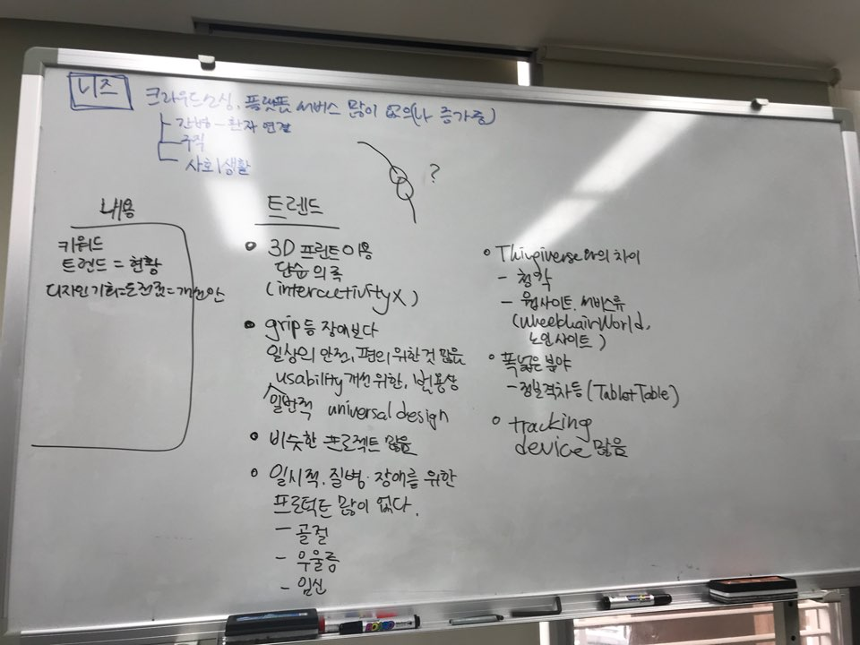

## 18/03/08 Meeting #1
### 키워드 추출 및 데이터 셋 분석
- Buehler 외, 논문에서 제시된 키워드 중심으로 킥스타터 데이터 셋 검색

- 검색된 데이터를 근거로 트렌드 분석
  - 3D 프린터를 이용한 단순 의족
  - 범용적, 일반적 Usability 개선을 위한 프로젝트
  - 일시적/상황적 질병, 장애를 위한 프로젝트 거의 없음

- **디자인 방향 제시 : 크라우드 소싱, 플랫폼 형태의 서비스**
****
## 18/03/12 Meeting #2
### 키워드 재추출 및 데이터 셋 재분석
- 기존의 Buehler 외, 논문에서 제시된 키워드는 Thingiverse 커뮤니티 중심의 키워드
- 하드웨어적 성향이 강하기 때문에, 브레인 스토밍을 통해 새로운 키워드 추가하고 정리하는 과정 거침

 

- **추출된 키워드로 데이터 셋 재분석 후 트렌드 도출**
  - 하드웨어 관련 프로젝트가 많음 : Specific 하고, 비슷한 프로젝트들이 많다
  - 소프트웨어 관련 프로젝트 : 절대적 개수는 적지만, Backer가 많고 보통 펀딩에 성공
  - 정신 장애 관련 프로젝트 적다
  - Community 관련 프로젝트 적다

